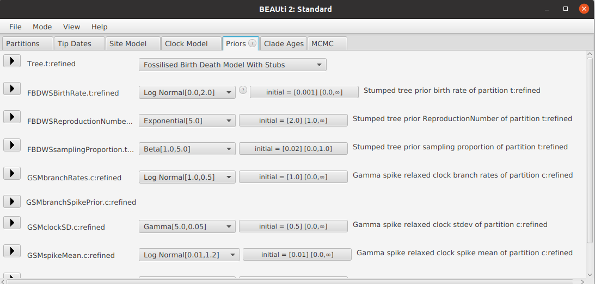

# Testing for punctuated equilibrium in BEAST 2

The gamma spike model is a phylogenetic clock model for BEAST 2. This method tests for punctuated equilibrium, by assigning each branch a gradual clock-rate and an instaneaneous spike of abrupt evolution. The magnitudes of each branch rate and branch spike are independent and identically distributed.  

The genetic distance of a branch takes the form:

```
distance = rate x length + spike
```


Advantages over other clock models:

1. Accounts for the common scenario where evolution is accelerated at the time of branching.
2. The hypothesis of punctuated equilibrium is tested during MCMC using model averaging.
3. If the hypothesis is rejected, then MCMC falls back on the relaxed clock ([ORC](https://github.com/jordandouglas/ORC) model).
4. If the hypothesis is accepted, then the estimated tree is likely to be more accurate.
5. In either case, the number of unobserved speciation events on each branch is also estimated (i.e., the *stubs*).


## Installation instructions


This package requires BEAST 2.7.7. or newer.

1. Launch BEAUti
2. Click on `File` -> `Manage Packages`
3. Install `gammaspike`. If it is not in the list of packages, you may need to add an extra package repository as follows:
- Click the `Packager repositories` button. A dialog pops up.
- Click the Add URL button. A dialog is shown where you can enter https://raw.githubusercontent.com/CompEvol/CBAN/master/packages-extra-2.7.xml
- Click `OK`. There should be an extra entry in the list.
- Click `Done`.
- After a short delay, `gammaspike` should appear in the list of packages.


## Setting up an analysis


1. Launch BEAUti.


2. Import data and set up site model, as per usual.

3. Open the `Clock Model` tab and select `Gamma Spike Relaxed Clock`.
	- This will introduce the following parameters
		- The mean spike size `GSMspikeMean` (under a Gamma distribution). High mean = larger expected spike sizes. 
		- The shape of spike sizes `GSMspikeShape` (Gamma distribution). High shape = smaller variance of spike sizes.
		- One `spike` for every branch in the tree, whose sizes are Gamma distributed under the prior.
		- The standard deviation `GSMclockSD` of branch rates under a gradual relaxed clock (for a LogNormal distribution). High standard deviation = higher variance of branch rates. Same meaning as relaxed clock / ORC model.
		- One `rate` for every branch in the tree, whose sizes are LogNormally distributed under the prior.
		- The `clockRate` in units of 'gradual changes per site per unit of time'. If there is no temporal information (e.g., tip dates, node calibrations) then leave this term fixed at 1.0. 
		- A boolean model indicator `GSMuseSpikeModel` that determines whether the spikes are being used or not.  


4. Open the `Priors` tab and select one of the following tree priors:
- `Birth Death Model With Stubs` (BDWS) is the standard birth-death model when tip dates are not used. Parameters:
    - Birth rate `BDWSBirthRate` .
    - Reproduction number `BDWSReproductionNumber`, which is assumed to be greater than 1. 
- `Fossilised Birth Death Model With Stubs` (FBDWS) is the [fossilised birth-death](https://www.beast2.org/divergence-dating-with-sampled-ancestors-fbd-model/) tree prior with serially sampled tip dates, sampled ancestors estimated, and the following parameters
	- Birth rate `FBDWSBirthRate` .
	- Reproduction number `FBDWSReproductionNumber`, which is assumed to be greater than 1. 
	- Sampling proportion `FBDWSsamplingProportion`.
	
By using one of these priors, the number of stubs on each branch will be logged and inform the clock model spike sizes. If a stumped tree prior is not selected, the clock model will assume there are no stubs on any branch. Currently, stubs are only available for these two tree priors (and not coalescent or skyline for instance).




5. Configure priors and save the XML file as per usual.


## Spikes
The total sum of spikes is estimated for each branch. The total spike sum `Si` on branch `i` follows a Gamma distribution under the prior:

```
Si ~ Gamma(shape=spikeShape*(ni + 1), scale=spikeMean/spikeShape)
```

where `ni` is the number of stubs on branch `i`. Longer branches and older branches usually have more stubs. The reported `spike` on each branch is the total sum of all `ni + 1` spikes along that branch.

Then `spikeMean` is the average number of changes per site per bifurcation (which may be observed or unobserved). For example an average spike size of 0.01 means that 1% of all sites are expected to change (possibly back into the original state) at each bifurcation - one per internal node and one per stub. We examined 8 empirical datasets with support for punctuated equilibrium, and found that `spikeMean` estimates ranged from 0.001 to 0.07. The default prior for `spikeMean` is centered around this interval. This is an important parameter, and testing for sensitivity is recommended.

BEAST 2 will log the following terms onto the tree:

- `BDWSstubs` or `FBDWSstubs`: number of stubs per branch (if using the appropriate tree prior).
- `GSMbranchRates`: the relative branch rates (relaxed clock).
- `GSMweightedSpikes`: the sum of all spikes along the branch (units: instantaneous changes per site along lineage).
- `rate`: the total rate of the branch accounting for both gradual (branchRates) and abrupt (spike) evolution. 


## Hypothesis testing

The `useSpikeModel` parameter can be used for hypothesis testing. When this parameter is 1, the spike model is being used, and when 0 the relaxed clock. Every dataset is different, with some strongly favouring one model over the other, and others being uncertain. 


By default, the model indicator `useSpikeModel` has a Bernoulli(0.5) prior distribtuion, meaning that the spike model is *a priori* assumed to be correct with 0.5 probability. If the average value of `useSpikeModel` is over 0.91 (corresponding to a Bayes factor of 10 in this case) there is strong support in favour of punctuated equilibrium. Less than 0.09 probability is strong evidence against the model at this threshold.


## Speeding up MCMC convergence

In most instances, we found this model converged reasonably well despite its large parameter space.  However, in some cases the `useSpikeModel` parameter lead to a bimodal distribution that caused mixing issues.  If this model is taking too long to converge, we recommend the following remedies:

1. Try using [Coupled MCMC](https://www.beast2.org/2020/01/14/metropolis-coupled-mcmcmc3-works.html).

2. Try running separate analyses with `useSpikeModel` respectivley fixed at either 0 or 1. Unfortunately, this configuration does not enable hypothesis testing (Bayesian model averaging). 

3. In general, it is good practice to run multiple MCMC chains in parallel and confirm they have converged to the same distribution. If they did, then the chains can be combined, thereby expediting the process.


## Example files

The `examples` directory contains:

1. Three case studies in `examples/cases/` that strongly favour the spike model:
 - `aaRS.xml`: Class I aminoacyl-tRNA synthetase amino acid sequences from [Douglas et al. 2024](https://www.aars.online).
- `cephalopods.xml`: Cephalopoda morphological traits from [Whalen and Landman 2021](https://doi.org/10.1038/s41467-022-28333-5).
- `indoeuropean.xml`: Indo-European cognate data from [Heggarty et al. 2023](https://doi.org/10.1126/science.abg0818).

2. The `examples/DS/` directory contains other datasets that have varying levels of support for the spike model:
- `DS1, DS2, ..., DS11.xml`: These eleven nucleotide datasets were collected by [Whidden and Matsen 2015](https://doi.org/10.1093/sysbio/syv006). Please refer to their article to find the respective references for each dataset.

3. **For developers:** the `examples/stubs/` directory contains XML files showing the three ways that stubs can be estimated. The three examples share a common tree that was simulated with birth rate 1.3, reproduction number 1.17, and sampling proportion 0.20. The true tree contains 20 extant taxa, 16 non-extant, and  has a height of 6.53 and a length of 30.63. The three files below should all sample the same distribution despite their different parameter space.

- `rjStuvs.xml`: the time and placement of each stub is estimated using reversible-jump MCMC. Note that special tree operators are required to handle stubs. This is the slowest at mixing.
- `nrStubs.xml`: number of stubs on each lineage is estimated using MCMC, but their times are integrated out.
- `stochasticStubs.xml`: the number of stubs on each lineage is sampled at the time of logging during MCMC, i.e., not as part of the state. This is the default setting, but less versatile than the other two. This is the fastest at mixing. Limitation: note that the number of stubs per-lineage is sampled at the time of logging. The number of stubs reported by the tree logger might not sum to the same value of `nstubs` reported by the trace logger. Both of these numbers are valid, but as the algorithm is stochastic, they will not be the same.


## Support

BEAST user forums [https://groups.google.com/g/beast-users](https://groups.google.com/g/beast-users)

Jordan Douglas jordan.douglas@auckland.ac.nz


## References

